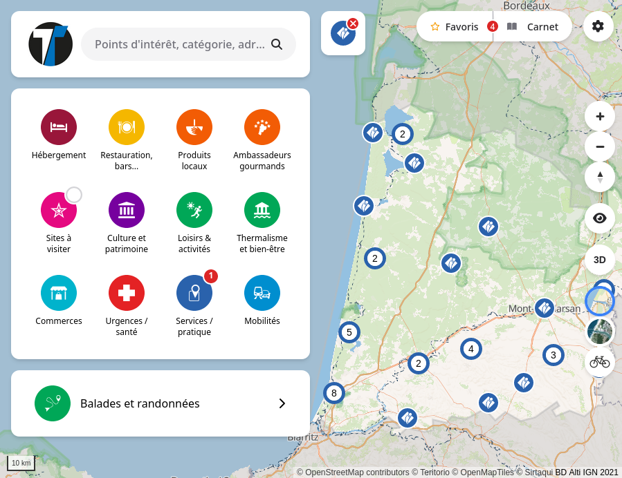
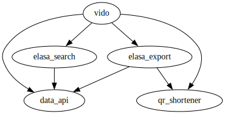

# @teritorio/vido

Vido is a web map application for browsing POIs organized in categories. The main features are:
- a slippy map
- a POI categories menu
- a full POIs browsing mode
- POI favorites and notebook
- page for each POI content
- list a POI be categories

Vido is the frontend for the [data API](https://dev.appcarto.teritorio.xyz/content/wp-content/plugins/ApiTeritorio/vendor/swagger-api/swagger-ui/dist/?url=https://dev.appcarto.teritorio.xyz//content/wp-content/plugins/ApiTeritorio/swagger-doc.yaml).

Vido use aside projects to:
- export list of POIs as PDF: [https://github.com/teritorio/elasa-export](https://github.com/teritorio/elasa-export)
- search for POIs: [elasa-search](https://github.com/teritorio/elasa-search)
- produce QR Code: [qr-shortener](https://github.com/teritorio/qr-shortener)

The web application target multiple devices: smartphones, desktops, and large touchscreens.



## Entry points

### Web
Full entry points documentation available on [api.yml](public/api.yaml) and on server at [http://localhost:3000/api.yaml](http://localhost:3000/api.yaml).

* Main Map:
  * Full page: `/`, `/{poi_Id}`, `/{category_ids}/` and `/{category_ids}/{poi_id}`.
  * Parameters:
    * `boundary`: an alternative boundary key from settings `polygons_extra`.
    * `clipingPolygonSlug`: POI filtering by polygon (key from settings `polygons_extra`).
* Embedded: `/embedded/`, same subpath and parameters as full page.
  * Parameters:
    * `showEmbeddedUi`: Show/hide category selector and selected categories indicator (values: true | false)
* POI:
  * details: `/poi/{id}/details`.
* POIs:
  * map only: `/pois/{ids}/map`.
* Categories
  * Empty list: `/category`
  * List of POIs by category ID: `/category/{id}`
* Categories (embedded):
  * Embedded empty list: `/category/embedded`
  * Embedded list of POIs by category ID: `/category/embedded/{id}`
    * Parameters:
      * `menuItemIds=[id,id]`: filters selector entries by categories IDs
      * `showEmbeddedUi`: Show/hide category selector and selected categories indicator (values: true | false)

### Sitemap & WPA
* `/manifest.webmanifest`
* `/sitemap.xml`

## Setup

Can be build directly (dev) or within Docker.

### Native Build Setup

**Prerequisite**

- Node ^14.18.0 || >=16.10.0

```bash
# Create empty config file, will be build on `build-config` step
cp vidos-config-empty.json vidos-config.json

# install dependencies
yarn install

# Generate fixtures
yarn build-fixture

# Generate configuration from `vidos.config.ts`
yarn build-config

# serve with hot reload at localhost:3000
yarn dev

# build for production and launch server
yarn build
yarn start
```

### Setup with Docker
```
cp .env.sample .env
docker compose build
docker compose run --rm vido yarn build-config
docker compose up -d
```

### Production configuration
Require server allows CORS on:
* `/api.yaml`: the swagger specification
Require server allows iframe usage on:
* `/pois/{ids}/map`: map intended to be used as iframe.

Apache2 configuration
```
<Location "/api.yaml">
Header set Access-Control-Allow-Origin "*"
</Location>
<LocationMatch "^/pois/.*/map$">
Header set Content-Security-Policy "frame-ancestors *"
</LocationMatch>
```

## Dev



Vido is mainly building using:
- [MapLibre GL JS](https://maplibre.org/maplibre-gl-js-docs/api/map/)
- [Nuxt 3](https://nuxt.com/) and [Vue 3](https://vuejs.org/), using both Options API / Composition API

```bash
# serve with hot reload at localhost:3000
yarn dev
```

### Dev with Historie, components stories
Run Historie with
```
yarn start:historie
```

Historie build also available on `gh-pages` branch built by CI and online at https://teritorio.github.io/vido/

### Tests
Run end to end tests with build or dev server:

```bash
cp vidos-config-cypress.json vidos-config.json

# With build
yarn test
yarn start # In a new terminal for separate logs

# With dev server (slower - not recommended)
yarn dev
## In a new terminal for separate logs
yarn test:gui
yarn test:cli

# The run Histoire component screenshot regression tests
yarn test:histoire
```

## Release

```bash
$ git checkout develop
$ npm version minor -m "chore: release %s"
$ git push --follow-tags
```

Then, create a PR from `develop` to `main`, it will launch the continuous development.

### Internals

## Details fields configurations

Popup and details special fields support:
* `addr`: combined all address fields.
* `route`: all routes activity types and fields.
* `coordinates`: geographic coordinates.
* `start_end_date`: combined `start_date` and `end_date` fields.
* `short_description`

Special formatting support:
* `opening_hours`
* `phone` and `mobile`

## Users tracking

| Event | Vido event | Vido actions | Google event | Google params | Matomo | Matomo params |
|----------------------------------|---------------------|---------------------------------------------|---------------------|------------------------------------------|-----------------|----------------------------------|
| Page loading (homepage, details) | page | | pageview | pageTitle, pageLocation, pagePath | trackPageView | title, Url, Origin |
| Navigation on a menu item | menu | | pageview | pageTitle, pagePath | trackPageView | title, Url |
| Enable or disable a category | category_event | enable, filter | category_event | action, categoryId | trackEvent | event, action, title, categoryId |
| Focus on the search area | search | | pageview | pageTitle, pagePath | trackPageView | title, Url |
| Seach query | search_query | | | | trackSiteSearch | query |
| Selecting a search result | search_result_event | | search_result_event | type, title | trackEvent | event, action, title, resultType |
| Opening the popup | popup | | pageview | pageTitle, pageLocation, pagePath, poiId | trackPageView | title, Url |
| Action on the popup | popup_event | details, route, explore, favorite, zoom, isochrone | popup_event | action, title, poiId, category | trackEvent | event, action, title, poiId |
| Action on the map control | map_control_event | 3d, explorer, favorite | map_control_event | action | trackEvent | event, action |
| Action on the map background control | map_control_event | background | map_control_event | action, background | trackEvent | event, action, background |
| Action on favorites | favorites_event | open_share, copy_link, exportPDF, exportCSV | favorites_event | action | trackEvent | event, action |
| Notebook | notebook_event | open | pageview | pageTitle, pagePath | trackPageView | title, Url |
| External links | external_link | | external_link | Url, title | trackLink | Url |
| Action on details page | details_event | favorite | details_event | action, title, poiId | trackEvent | event, action, title, poiId |
| Select isochrone profile | isochrone_event | select_profile | isochrone_event | action, profile | trackEvent | event, action, profile |

Note on Matomo. `Origin` is a set as dimension `1` and should be configured as is on Matomo.

## Contributor Mode
Enable/Disable: Add the following query parameter in the URL: `?contrib=true|false`
